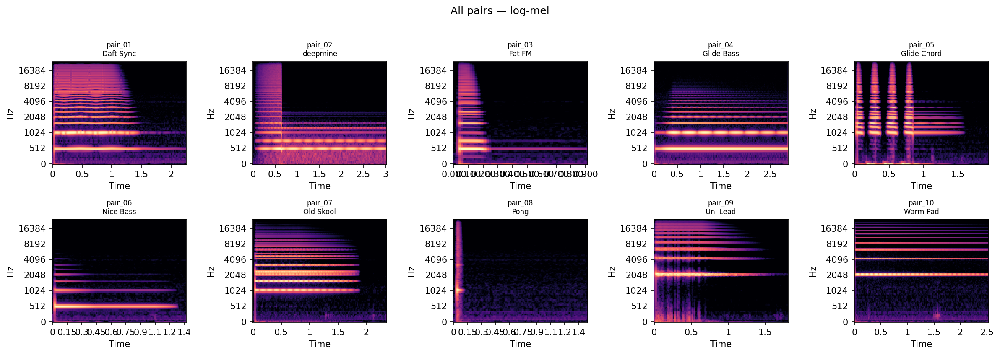

# Paired v1 — PRO-800 patch + render (10 pairs)



## Where this fits

Phase 1 explored deterministic timbre → patch mapping; **paired_v1** adds **ground-truth** pairs (`source.syx` + `render.wav` + `patch.json`) under a fixed performance protocol. The figure above is a quick check that **different presets produce distinct spectral energy** under that protocol.

## Next steps (research)

- **B:** Small table / plots: audio summary stats vs selected knob values across pairs.
- **C:** Run Phase 1 analyze/map on each `render.wav` and compare to `patch.json` (pipeline sanity).
- **D:** More pairs (and optional MIDI 48 re-capture) before serious audio→parameter learning.

---

**Purpose:** One folder per preset: exact bank `source.syx` + `render.wav` (hardware line/USB) + `meta.json` + decoded `patch.json` for ML / plots.

Regenerate the overview figure from the experiment root:

```bash
python dataset/paired_v1/tools/render_mel_grid.py
```

## Frozen performance protocol (v1)

| Field | Value |
|-------|--------|
| MIDI channel | 1 (one-based) — **document if you use 0-based in DAW** |
| Note | Single note **C4 (MIDI 60)** for entire take — **v1 captures used this note** |
| Velocity | **100** |
| Length | Hold **~1.0 s** after attack, allow **~1.5 s** release tail before stop |
| PRO-800 mode | As you normally use (poly/unison) — **log in each `meta.json` if it changes** |
| Sample rate | **48000 Hz**, **24-bit** WAV mono or stereo (match DAW export) |
| Input gain | **Fixed** for all 10 — describe knob position or interface setting in `meta.json` |

### v2 re-capture (recommended)

For new recordings, default to **C3 (MIDI 48)** so bass-heavy patches sit more comfortably in range; document the actual note in each `meta.json` as `midi_note` (48 or 60, etc.).

## Trim leading silence (`tools/trim_renders.py`)

After export, DAW files often have **long pre-roll**. From the experiment root:

```bash
python dataset/paired_v1/tools/trim_renders.py
python dataset/paired_v1/tools/trim_renders.py --pre-roll-ms 20
python dataset/paired_v1/tools/trim_renders.py --backup
```

- Walks every `pair_XX/` that contains `render.wav`.
- Detects the **first onset** (librosa `onset_detect`, with an RMS fallback).
- Trims so playback starts **`pre_roll_ms` milliseconds before** that onset (default **15**).
- Overwrites `render.wav` in place; **`--backup`** writes `render.wav.bak` first.
- Preserves **sample rate** and **channel layout** (mono vs stereo).
- Updates `meta.json` with `trim_applied`, `trim_pre_roll_ms`, and related sample counts.

## Merge staged drops (`tools/merge_new_folder.py`)

If you drop matched **`Stem.wav` + `Stem.syx`** into `dataset/paired_v1/New folder/`, run:

```bash
python dataset/paired_v1/tools/merge_new_folder.py
```

Stems are sorted **case-insensitively** and assigned to `pair_01` … `pair_10`; `manifest.csv` and each `meta.json` are rewritten. Then run `decode_patches.py`, `trim_renders.py`, and `validate_pairs.py`.

## Load path (pick one for all 10)

- **A:** SynthTribe — import `pair_XX/source.syx` into target slot, then record.
- **B:** Repo — `python -m cli.main send-syx --file dataset/paired_v1/pair_XX/source.syx` (adjust flags per your `cli` help).

Set `load_method` in each `meta.json` to `synthtribe` or `send_syx`.

## `render.wav` status

Files named `render.wav` may be **short silence placeholders** until you overwrite them with **real DAW captures** from the PRO-800 following the protocol above. After recording, run:

```bash
python dataset/paired_v1/tools/validate_pairs.py
```

(All `dataset/paired_v1/tools/*.py` commands assume the **experiment root** `experiments/04-audio-to-pro800-patch/` as the current working directory.)

## License

Only commit or share `source.syx` copies you are allowed to redistribute.
