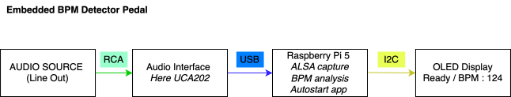

# Raspberry Pi Audio – Real-Time BPM Estimator

Standalone real-time BPM detection system using a Raspberry Pi and USB audio interface.
The system captures live audio, estimates tempo using autocorrelation, and displays BPM on an OLED display.

Designed to operate as a **bootable hardware appliance** controllable remotely via SSH.


Stable real-time BPM detection using a Raspberry Pi 5 and Audio Interface.
[]

---
## Hardware

- Raspberry Pi 5
- USB Audio Interface (e.g. Steinberg UR22 / Behringer)
- SH1106 OLED display (I2C)
- USB power supply
- 
This project is a standalone Raspberry Pi 5 device that captures live audio from a USB interface and displays a stable real-time BPM on an SH1106 OLED using an autocorrelation-based estimator.
Audio is captured at 44.1 kHz via ALSA, mixed to mono, converted to an energy envelope, buffered (~8s), processed with FFT autocorrelation, peak-detected, folded into 90–180 BPM, smoothed with hysteresis, and rendered to the OLED.
Hardware: Raspberry Pi 5, Behringer UCA202 (USB Audio CODEC), SH1106 I2C OLED (0x3C); Software: Raspberry Pi OS Bookworm Lite 64-bit, Python venv, numpy, sounddevice, luma.oled, pillow.
The engine prioritizes stability over instant lock, achieves accurate tempo tracking with low CPU usage on Pi 5, and is designed for live pedal-style operation.
Planned improvements include faster initial lock via dual-window estimation, silence hold behavior, beat phase indication, and systemd appliance-mode autostart.


## Software

OS: Raspberry Pi OS Bookworm (64-bit Lite)

Python libraries:
- numpy
- sounddevice
- luma.oled
- pillow


python3 -m venv .venv
source .venv/bin/activate
pip install numpy sounddevice luma.oled pillow

## Run manually

cd ~/realtime-bpm
source .venv/bin/activate
python bpm_oled_autocorr_fast.py


systemctl status bpm

## Auto-start BPM engine at boot

Create service file:

sudo nano /etc/systemd/system/bpm.service

[Unit]
Description=BPM Estimator
After=network.target

[Service]
User=uzan
WorkingDirectory=/home/uzan
ExecStart=/home/uzan/.venv/bin/python /home/uzan/bpm_oled_autocorr_fast.py
Restart=always

[Install]
WantedBy=multi-user.target

sudo systemctl daemon-reload
sudo systemctl enable bpm
sudo systemctl start bpm


## Remote control via SSH (iPhone / Termius)

Connect:


quick start on the laptop remote connection 
ssh uzan@jeremybboy.local


sudo systemctl start bpm
sudo systemctl stop bpm
sudo systemctl restart bpm
systemctl status bpm

source oled-env/bin/activate


python3 bpm_oled_autocorr_fast.py 


Network setup 
nmcli device wifi connect "SSID" password "password"


The script captures stereo audio from the USB Audio CODEC at 44.1 kHz, mixes it to mono in a callback, and continuously stores samples in an 8-second rolling buffer.

Every 0.5 seconds, if the signal RMS is above a noise threshold, it computes a smoothed energy envelope (rectify + 25 ms low-pass) and runs an FFT-based autocorrelation to estimate the dominant tempo lag.

It converts the detected lag to BPM, folds half/double-time into the 90–180 BPM range, and applies hysteresis smoothing so the displayed BPM is stable but still responsive.

During the first few seconds after startup, it uses a shorter analysis window for faster initial lock, then switches to a longer window for improved stability.

The locked BPM, RMS level, and device info are rendered to the SH1106 OLED in real time, while debug information is printed to the terminal.


BPM Algorithm 
The algorithm first converts the audio to mono, computes an RMS check for signal presence, and generates an energy envelope by rectifying the signal and applying a short low-pass filter (~25 ms).

It applies a Hann window and computes an FFT-based autocorrelation of the envelope to efficiently measure periodicity over a multi-second buffer.

It searches for the strongest autocorrelation peak within a lag range corresponding to 90–180 BPM, then refines the peak position using parabolic interpolation for sub-sample accuracy.

The detected period is converted to BPM and folded into the target range by doubling or halving to correct half-time or double-time errors.

Finally, it applies hysteresis smoothing so small changes follow quickly while larger jumps are damped, producing a stable displayed tempo.


## Libraries Requirements
pip install numpy sounddevice luma.oled pillow


# enable I2C
sudo raspi-config
# Interface Options → I2C → Enable
sudo reboot

i2cdetect -y 1

You should see 3c

## Run the program

chmod +x ~/bpm_oled_autocorr_fast.py 

python3 bpm_oled_autocorr_fast.py


## ⚙️ System

**Hardware**
- Raspberry Pi 5  
- USB Audio Interface
- I2C Oled display

**OS**
- Raspberry Pi OS Bookworm 64-bit Lite  

**Audio**
- ALSA capture  
- 44.1 kHz  
- Stereo → mono mix  


## 🐍 Setup (Recommended: Virtual Environment)

```bash
mkdir oled-env
cd oled-env
python3 -m venv .venv
source .venv/bin/activate
pip install numpy sounddevice aubio
```

---

## ▶ Run

```bash
python3 bpm_oled_autocorr_fast.py
```

---

## 🔁 After Reboot / New SSH Session

```bash
cd ~/oled-env
source .venv/bin/activate
python3 bpm_oled_autocorr_fast.py
```

---

## 🧠 Architecture (current – v2.0 Autocorrelation Engine)

Capture stereo input via sounddevice (ALSA 44.1kHz)
Convert to mono
Rectify + low-pass filter → energy envelope
Maintain rolling buffer (~8s)
Compute FFT-based autocorrelation on envelope
Detect dominant lag peak
Convert lag → BPM
Fold half/double-time into 90–180 BPM range
Apply hysteresis smoothing
Render stable BPM to SH1106 OLED

## 📊 Processing Flow
```json
{
  "audio_input": "Audio Interface (USB Audio CODEC)",
  "capture": "ALSA 44.1kHz stereo",
  "mono_mix": "L+R / 2",
  "envelope": "Rectify + Low-pass",
  "buffer": "~8s rolling window",
  "tempo_estimation": "FFT Autocorrelation",
  "peak_detection": "Dominant lag",
  "bpm_calc": "60 / period",
  "post_processing": "Half/Double-time fold + Hysteresis",
  "output": "SH1106 OLED (real-time BPM)"
}
```

## 🧠 Architecture (old)

1. Capture stereo input via `sounddevice`
2. Convert to mono
3. Detect beats using `aubio.tempo()`
4. Store IOIs (Inter-Onset Intervals)
5. Compute:

```
BPM = 60 / mean(IOI)
```

6. Print BPM every 2 seconds

---

## 📊 Processing Flow

```json
{
  "audio_input": "Audio Interface",
  "capture": "ALSA 44.1kHz",
  "stream": "sounddevice InputStream",
  "beat_detection": "aubio.tempo()",
  "buffer": "IOI sliding window",
  "bpm_calc": "60 / mean(IOI)",
  "output": "CLI (2s interval)"
}
```

---

## ✅ Status

✔ Stable  
✔ Low CPU  
✔ Production-ready baseline  

---

**Version:** 1.0

source oled-env/bin/activate

# TODO – Next Iteration (v2.1)

## 1. Faster Initial Lock
- Implement dual-window system (2s fast estimator + 8s stable estimator)
- Add confidence metric (peak strength + short-term stability)
- Display provisional BPM (~) until confirmed

## 2. Silence Hold Logic
- Add RMS gate threshold
- Freeze last BPM when below threshold
- Add small “HOLD” indicator on OLED

## 3. Beat Phase Indicator
- Implement simple phase accumulator (0–1 per beat)
- Sync phase using envelope peaks
- Render minimal visual progress indicator on OLED
